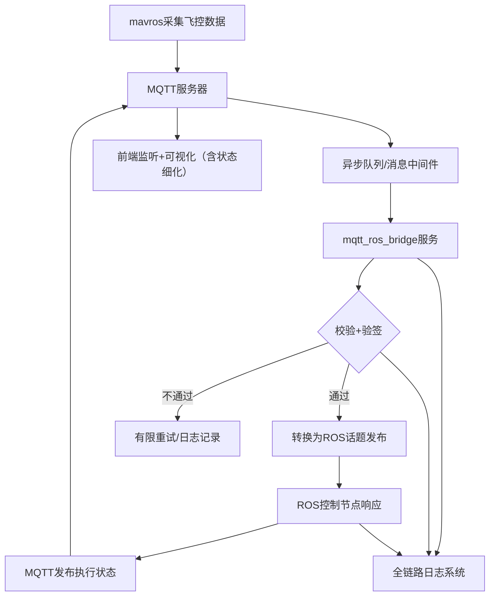

```mermaid
flowchart TB
    A[mavros采集飞控数据] --> B[MQTT服务器]
    B --> C[异步队列/消息中间件]
    C --> D[mqtt_ros_bridge服务]
    D --> E{校验+验签}
    E -- 通过 --> F[转换为ROS话题发布]
    E -- 不通过 --> G[有限重试/日志记录]
    F --> H[ROS控制节点响应]
    H --> I[MQTT发布执行状态]
    I --> B
    B --> J[前端监听+可视化（含状态细化）]
    %% 补充：日志/监控链路
    D --> K[全链路日志系统]
    E --> K
    H --> K
```

