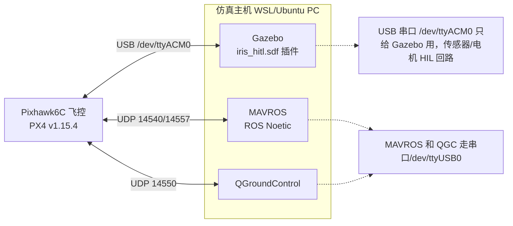

```mermaid
flowchart LR
    subgraph PC[仿真主机 WSL/Ubuntu PC]
        GZ[Gazebo<br/>iris_hitl.sdf 插件]
        MAV[MAVROS<br/>ROS Noetic]
        QGC[QGroundControl]
    end

    PX4[Pixhawk6C 飞控<br/>PX4 v1.15.4]

    %% USB 串口直连
    PX4 <-->|USB /dev/ttyACM0| GZ

    %% UDP 链路
    PX4 <-->|UDP 14540/14557| MAV
    PX4 <-->|UDP 14550| QGC

    %% 注释
    note1["USB 串口 /dev/ttyACM0 只给 Gazebo 用，传感器/电机 HIL 回路"]
    note2["MAVROS 和 QGC 走串口/dev/ttyUSB0"]

    GZ -.-> note1
    MAV -.-> note2
    QGC -.-> note2
```