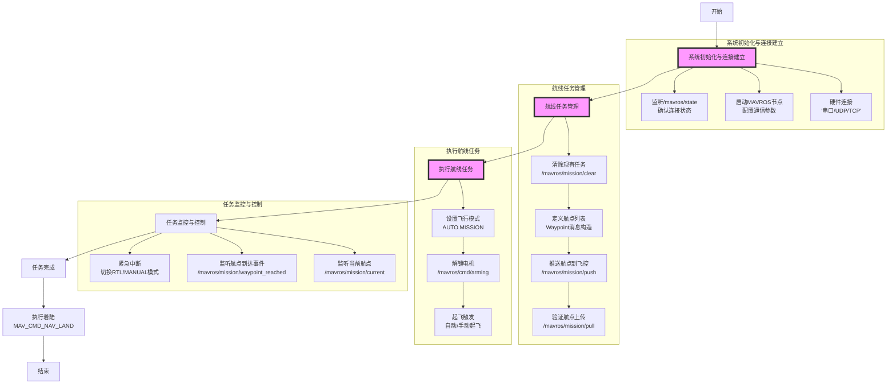

# MAVROS实现PX4航线规划的流程梳理

## 流程图

## 流程说明

1. **系统初始化与连接建立**：通过硬件接口建立通信，启动MAVROS节点并验证连接状态
2. **航线任务管理**：清除历史任务，定义航点列表（包含坐标、高度、指令类型等），上传并验证航点
3. **执行航线任务**：切换至任务模式，解锁电机并触发起飞
4. **任务监控与控制**：实时跟踪航点执行进度，处理异常情况
5. **任务完成**：执行着陆流程，结束任务

> 关键接口：`/mavros/mission/*`服务（清除/推送/拉取航点）、`/mavros/set_mode`（模式切换）、`/mavros/cmd/arming`（电机解锁）