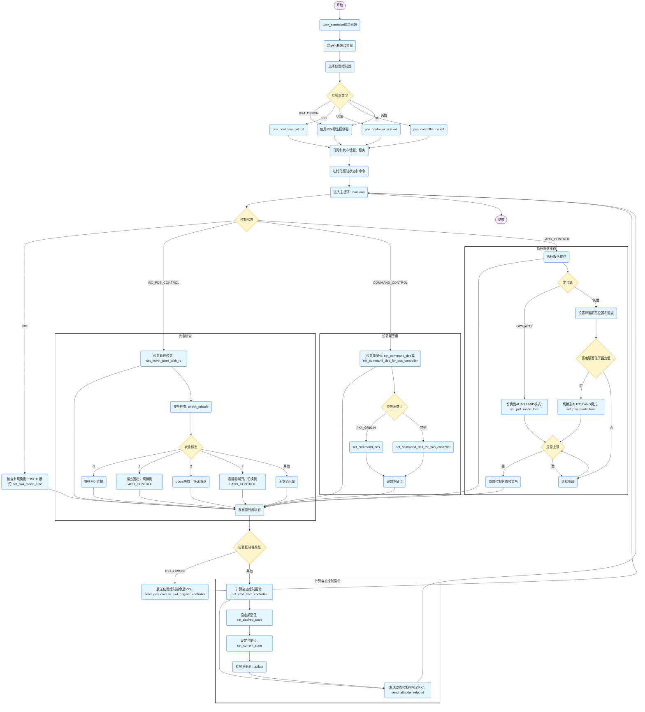

```mermaid
graph TD;
    classDef startend fill:#F5EBFF,stroke:#BE8FED,stroke-width:2px;
    classDef process fill:#E5F6FF,stroke:#73A6FF,stroke-width:2px;
    classDef decision fill:#FFF6CC,stroke:#FFBC52,stroke-width:2px;
    classDef io fill:#FFEBEB,stroke:#E68994,stroke-width:2px;
    
    A([开始]):::startend --> B(UAV_controller构造函数):::process;
    B --> C(初始化参数和变量):::process;
    C --> D(选择位置控制器):::process;
    D --> E{控制器类型}:::decision;
    E -->|PX4_ORIGIN| F(使用PX4原生控制器):::process;
    E -->|PID| G(pos_controller_pid.init):::process;
    E -->|UDE| H(pos_controller_ude.init):::process;
    E -->|NE| I(pos_controller_ne.init):::process;
    E -->|其他| F;
    F --> J(订阅和发布话题、服务):::process;
    G --> J;
    H --> J;
    I --> J;
    J --> K(初始化控制状态和命令):::process;
    K --> L(进入主循环: mainloop):::process;
    L --> M{控制状态}:::decision;
    M -->|INIT| N(检查并切换到POSCTL模式: set_px4_mode_func):::process;
    M -->|RC_POS_CONTROL| O(设置悬停位置: set_hover_pose_with_rc):::process;
    M -->|COMMAND_CONTROL| P(设置期望值: set_command_des或set_command_des_for_pos_controller):::process;
    M -->|LAND_CONTROL| Q(执行降落操作):::process;
    N --> R(发布控制器状态):::process;
    O --> R;
    P --> R;
    Q --> R;
    R --> S{位置控制器类型}:::decision;
    S -->|PX4_ORIGIN| T(发送位置控制指令至PX4: send_pos_cmd_to_px4_original_controller):::process;
    S -->|其他| U(计算姿态控制指令: get_cmd_from_controller):::process;
    U --> V(发送姿态控制指令至PX4: send_attitude_setpoint):::process;
    T --> L;
    V --> L;
    L --> Z([结束]):::startend;
    
    subgraph 安全检查
        style 安全检查 fill:#ffffff,stroke:#000000,stroke-width:2px;
        O --> AA(安全检查: check_failsafe):::process;
        AA --> AB{安全标志}:::decision;
        AB -->|-1| AC(等待PX4连接):::process;
        AB -->|1| AD(超出围栏，切换到LAND_CONTROL):::process;
        AB -->|2| AE(odom失效，快速降落):::process;
        AB -->|3| AF(遥控器断开，切换到LAND_CONTROL):::process;
        AB -->|其他| AG(无安全问题):::process;
        AC --> R;
        AD --> R;
        AE --> R;
        AF --> R;
        AG --> R;
    end
    
    subgraph 计算姿态控制指令
        style 计算姿态控制指令 fill:#ffffff,stroke:#000000,stroke-width:2px;
        U --> AH(设定期望值: set_desired_state):::process;
        AH --> AI(设定当前值: set_current_state):::process;
        AI --> AJ(控制器更新: update):::process;
        AJ --> V;
    end
    
    subgraph 设置期望值
        style 设置期望值 fill:#ffffff,stroke:#000000,stroke-width:2px;
        P --> AK{控制器类型}:::decision;
        AK -->|PX4_ORIGIN| AL(set_command_des):::process;
        AK -->|其他| AM(set_command_des_for_pos_controller):::process;
        AL --> AN(设置期望值):::process;
        AM --> AN;
        AN --> R;
    end
    
    subgraph 执行降落操作
        style 执行降落操作 fill:#ffffff,stroke:#000000,stroke-width:2px;
        Q --> AO{定位源}:::decision;
        AO -->|GPS或RTK| AP(切换到AUTO.LAND模式: set_px4_mode_func):::process;
        AO -->|其他| AQ(设置降落期望位置和速度):::process;
        AQ --> AR{高度是否低于指定值}:::decision;
        AR -->|是| AS(切换到AUTO.LAND模式: set_px4_mode_func):::process;
        AR -->|否| AT(继续降落):::process;
        AP --> AU{是否上锁}:::decision;
        AS --> AU;
        AT --> AU;
        AU -->|是| AV(重置控制状态和命令):::process;
        AV --> R;
        AU -->|否| AT;
    end
```