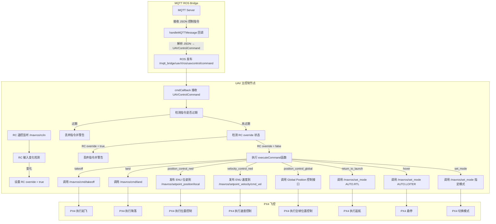

```mermaid
flowchart TD
    subgraph MQTT ROS Bridge
        A1[MQTT Server] -->|接收 JSON 控制指令| A2[handleMQTTMessage 回调]
        A2 -->|解析 JSON → UAVControlCommand| A3[ROS 发布 /mqtt_bridge/uavX/ros/uavcontrol/command]
    end

    subgraph UAV 主控制节点
        A3 --> B1[cmdCallback 接收 UAVControlCommand]

        B2[RC 遥控监听 /mavros/rc/in] --> B3[RC 输入变化检测]
        B3 -->|变化| B4[设置 RC override = true]

        B1 --> C1[检测指令是否过期]
        C1 -->|过期| C2[丢弃指令并警告]

        C1 -->|未过期| C3[检测 RC override 状态]
        C3 -->|RC override = true| C4[丢弃指令并警告]
        C3 -->|RC override = false| C5[执行 executeCommand函数]

        C5 -->|takeoff| D1[调用 /mavros/cmd/takeoff]
        C5 -->|land| D2[调用 /mavros/cmd/land]
        C5 -->|position_control_ned| D3[发布 ENU 位姿到 /mavros/setpoint_position/local]
        C5 -->|velocity_control_ned| D4[发布 ENU 速度到 /mavros/setpoint_velocity/cmd_vel]
        C5 -->|position_control_global| D5[调用 Global Position 控制接口]
        C5 -->|return_to_launch| D6[调用 /mavros/set_mode AUTO.RTL]
        C5 -->|hover| D7[调用 /mavros/set_mode AUTO.LOITER]
        C5 -->|set_mode| D8[调用 /mavros/set_mode 指定模式]
    end

    subgraph PX4 飞控
        D1 --> E1[PX4 执行起飞]
        D2 --> E2[PX4 执行降落]
        D3 --> E3[PX4 执行位置控制]
        D4 --> E4[PX4 执行速度控制]
        D5 --> E5[PX4 执行全球位置控制]
        D6 --> E6[PX4 执行返航]
        D7 --> E7[PX4 悬停]
        D8 --> E8[PX4 切换模式]
    end
```