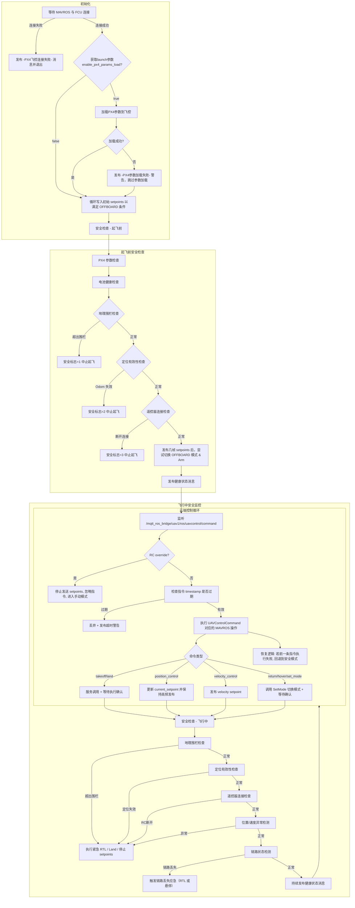

```mermaid
flowchart TD
    %% 初始化阶段
    subgraph 初始化
      A1[等待 MAVROS 与 FCU 连接] 
      A1 -->|连接失败| AF[发布 -PX4飞控连接失败- 消息并退出]
      A1 -->|连接成功| A1_1{获取launch参数enable_px4_params_load?}
      A1_1 -- false --> A2[循环写入初始 setpoints 以满足 OFFBOARD 条件]
      A1_1 -- true --> A1_2[加载PX4参数到飞控]
      A1_2 --> A1_3{加载成功?}
      A1_3 -- 是 --> A2
      A1_3 -- 否 --> AF1[发布 -PX4参数加载失败- 警告，跳过参数加载]
      AF1 --> A2
      A2 --> A3[安全检查 - 起飞前]
    end

    %% 起飞前安全检查
    subgraph 起飞前安全检查
      A3 --> P1[PX4 参数检查]
      P1 --> P2[电池健康检查]
      P2 --> C1{地理围栏检查}
      C1 -- 超出围栏 --> F1[安全标志=1 中止起飞]
      C1 -- 正常 --> C2{定位有效性检查}
      C2 -- Odom 失效 --> F2[安全标志=2 中止起飞]
      C2 -- 正常 --> C3{遥控器连接检查}
      C3 -- 断开连接 --> F3[安全标志=3 中止起飞]
      C3 -- 正常 --> A4[发布几帧 setpoints 后，尝试切换 OFFBOARD 模式 & Arm]
      A4 --> H1[发布健康状态消息]
    end

    %% 云端控制循环
    subgraph 云端控制循环
      H1 --> B1[监听 /mqtt_ros_bridge/uav1/ros/uavcontrol/command]
      B1 --> B2{RC override?}
      B2 -- 是 --> B3[停止发送 setpoints, 忽略指令, 进入手动模式]
      B2 -- 否 --> B4[检查指令 timestamp 是否过期]
      B4 -- 过期 --> B5[丢弃 + 发布超时警告]
      B4 -- 有效 --> B6[执行 UAVControlCommand 对应的 MAVROS 操作]
      B6 --> B7{命令类型}
      B7 -- takeoff/land --> C4[服务调用 + 等待执行确认]
      B7 -- position_control --> C5[更新 current_setpoint 并保持高频发布]
      B7 -- velocity_control --> C6[发布 velocity setpoint]
      B7 -- return/hover/set_mode --> C7[调用 SetMode 切换模式 + 等待确认]
      B6 --> R1[恢复逻辑: 若前一条指令执行失败, 回退到安全模式]
    end

    %% 飞行中安全监控
    subgraph 飞行中安全监控
      C4 --> E1[安全检查 - 飞行中]
      C5 --> E1
      C6 --> E1
      C7 --> E1
      E1 --> G1[地理围栏检查]
      G1 -- 超出围栏 --> E2[执行紧急 RTL / Land / 停止 setpoints]
      G1 -- 正常 --> G2[定位有效性检查]
      G2 -- 定位失效 --> E2
      G2 -- 正常 --> G3[遥控器连接检查]
      G3 -- RC断开 --> E2
      G3 -- 正常 --> E3[位置/速度异常检测]
      E3 -- 异常 --> E2
      E3 -- 正常 --> E4[链路状态检测]
      E4 -- 链路丢失 --> E5[触发链路丢失应急（RTL 或悬停）]
      E4 -- 正常 --> E6[持续发布健康状态消息]
      E6 --> 云端控制循环
    end
```