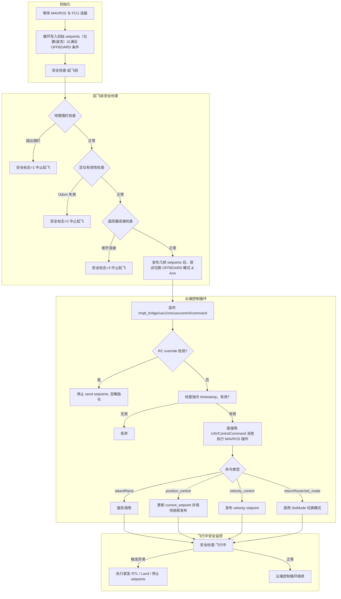

```mermaid
flowchart TD
    subgraph 初始化
      A1[等待 MAVROS 与 FCU 连接] --> A2[循环写入初始 setpoints（位置/姿态）以满足 OFFBOARD 条件]
      A2 --> A3[安全检查-起飞前]
    end

    subgraph 起飞前安全检查
      A3 --> C1{地理围栏检查}
      C1 -- 超出围栏 --> F1[安全标志=1 中止起飞]
      C1 -- 正常 --> C2{定位有效性检查}
      C2 -- Odom 失效 --> F2[安全标志=2 中止起飞]
      C2 -- 正常 --> C3{遥控器连接检查}
      C3 -- 断开连接 --> F3[安全标志=3 中止起飞]
      C3 -- 正常 --> A4[发布几帧 setpoints 后，尝试切换 OFFBOARD 模式 & Arm]
    end

    subgraph 云端控制循环
      A4 --> B1[监听 /mqtt_bridge/uav1/ros/uavcontrol/command]
      B1 --> B2{RC override 检测?}
      B2 -- 是 --> B3[停止 send setpoints, 忽略指令]
      B2 -- 否 --> B4[检查指令 timestamp，有效?]
      B4 -- 无效 --> B5[丢弃]
      B4 -- 有效 --> B6[直接用 UAVControlCommand 消息执行 MAVROS 操作]
      B6 --> B7{命令类型}
      B7 -- takeoff/land --> C4[服务调用]
      B7 -- position_control --> C5[更新 current_setpoint 并保持高频发布]
      B7 -- velocity_control --> C6[发布 velocity setpoint]
      B7 -- return/hover/set_mode --> C7[调用 SetMode 切换模式]
    end

    subgraph 飞行中安全监控
      C4 --> E1[安全检查-飞行中]
      C5 --> E1
      C6 --> E1
      C7 --> E1
      E1 -- 触发异常 --> E2[执行紧急 RTL / Land / 停止 setpoints]
      E1 -- 正常 --> 云端控制循环继续
    end
```