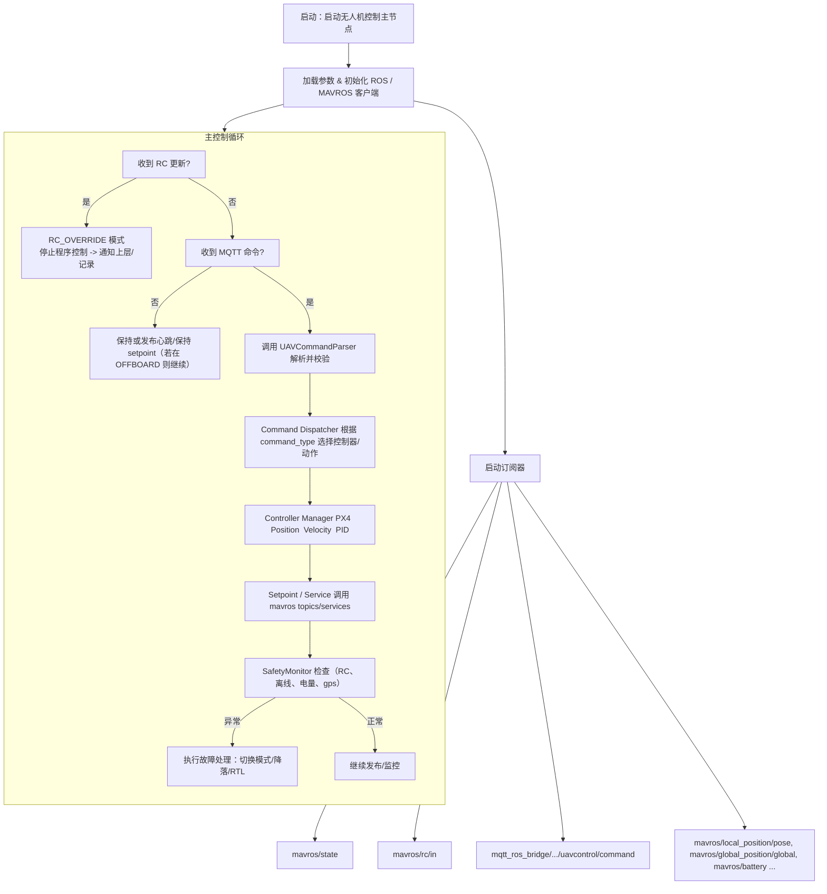

```mermaid
flowchart TD
  A[启动：启动无人机控制主节点] --> B[加载参数 & 初始化 ROS / MAVROS 客户端]
  B --> C[启动订阅器]
  C --> C1[mavros/state]
  C --> C2[mavros/rc/in]
  C --> C3[mqtt_ros_bridge/.../uavcontrol/command]
  C --> C4[mavros/local_position/pose, mavros/global_position/global, mavros/battery ...]
  
  %% Decision loop
  subgraph ControlLoop [主控制循环]
    direction TB
    D1[收到 RC 更新?] -->|是| RC_OVERRIDE[RC_OVERRIDE 模式\n停止程序控制 -> 通知上层/记录]
    D1 -->|否| D2[收到 MQTT 命令?]
    D2 -->|否| IDLE[保持或发布心跳/保持 setpoint（若在 OFFBOARD 则继续）]
    D2 -->|是| PARSE[调用 UAVCommandParser 解析并校验]
    PARSE --> DISPATCH[Command Dispatcher 根据 command_type 选择控制器/动作]
    DISPATCH --> CTRL[Controller Manager PX4  Position  Velocity  PID]
    CTRL --> PUB[Setpoint / Service 调用 mavros topics/services]
    PUB --> MON[SafetyMonitor 检查（RC、离线、电量、gps）]
    MON -->|异常| SAFETY[执行故障处理：切换模式/降落/RTL]
    MON -->|正常| CONTINUE[继续发布/监控]
  end

  B --> ControlLoop
```